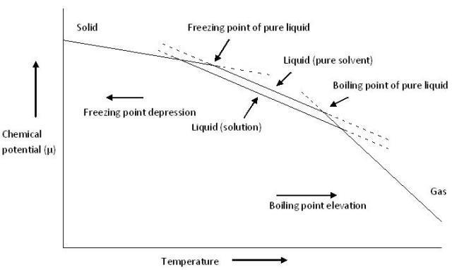

## Theory

### Cryoscopy:
 

#### Depression in Freezing Point:

The freezing point of a liquid substance is the temperature at which the liquid and its solid form are in equilibrium. The phenomenon that the Freezing point of a solvent will be lower when another compound is added is known as depression in freezing point, i.e., a pure solvent has a higher freezing point than a solution. This happens whenever a solute is added to a pure solvent. It is also a colligative property dependent only on the number of particles added and not the kind. It is defined as the difference in the freezing points of the pure solvent and solution, the difference between the freezing points of the solution, $T'_f$ and the pure solvent, $T_f$.

$$\Delta T_f=T_f-T'_f$$

This is a colligative property which does not depend on the nature of solute particles but depend only on the number of those solute particles in solution. The elevation of the boiling point can be calculated by applying the assumption of the non-volatility of the solute together with the Clausius-Clapeyron relation and Raoult's law.

Raoult's law:
 
The vapour pressure of a solution of a non-volatile solute is equal to the product of the vapour pressure of the pure solvent at that temperature and its mole fraction.
In equilibrium, the total vapour pressure, $\rho$ of the solution is:

$$\rho = \rho^*_A X_A + \rho^*_B X_B$$

As the number of components in a solution increases, the individual vapour pressure decreases, i.e. the mole fraction of each component is indirectly proportional to each additional component and the individual vapour pressure for each component is:

$$\rho_i = \rho^\*X_i$$

Where, $\rho_i$ is the partial pressure of the component i in the solution; $\rho^\*_i$ is the vapour pressure of the pure component i; and $X_i$ is the mole fraction of the component i in the solution (in mixture).

In addition to measuring the difference (a procedure called cryoscopy) the depression in freezing point can be found using the following equation if the solute is known:

$$\Delta T_f=K_f.i.m$$

Where $\Delta T_f$ is the depression of the freezing point; m is the molality of the solution; and i is the van 't Hoff factor. Molality of a solution is the ratio of the  amount of substance of solute and the mass of  solvent in kg.

The value of van ‘t Hoff factor depends upon the number of individual ions formed in solution. i.e:

- i = 1 for sugar in water.
- i = 2 for sodium chloride (NaCl) in water, due to the its full dissociation into Na+ and $\ce{Cl^-}$ ions.
- i = 3 for calcium chloride (CaCl2) in water, due to its full dissociation $\ce{Ca^2+}$ and $\ce{2Cl^-}$ ions.

The van 't Hoff factor is a measure of the colligative effect (the total number of particles) of the solute in solution. The value of i is usually unity for all non-electrolytes, greater than unity for electrolytes, but is less than unity for compounds that associate in solution.

$K_f$ is the molal freezing point depression constant or cryoscopic constant of the solvent, and it is depends upon the properties of the solvent. Which can be calculated as:

$$K_f=R.T^2_f.M/\Delta H_f$

 Where, R is the gas constant; $T_F$ is the freezing temperature of the pure solvent (in K); M is the molar mass of the solvent; and $\Delta H_f$ is the heat of fusion per mole of solvent. Note: although the above equation yields a positive value for $K_f$ by convention $K_f$ is represented as a negative value, resulting in observed and calculated negative values for $\Delta T_f$.

Similarly as in the case using the observed elevation in the boiling point, it is possible to calculate the molecular mass of a solute from the observed depression in the freezing point by using the equation: 

$$M_B=\frac{1000.K_f.i.W_B}{\Delta T_f.W_A}$$

Where $W_B$ is the weight of the solute; $W_A$ is the weight of solvent; $\Delta T_f$ is the elevation of the boiling point; $K_f$ molal freezing point depression constant; and i is the van 't Hoff factor.

 

